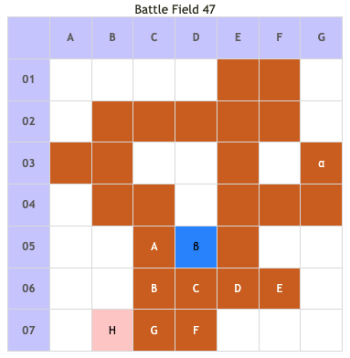

# Battle Field 47 大神殿

- 出撃ユニット ユグドラ・ミラノ+3人
- カード9枚
- 夜固定

## 勝利条件 

- 堕天のネシアを撃破せよ！

## 敗北条件 

- ユグドラorミラノ戦死 カードを使い果たす

## マップ 

## 取得可能アイテム 

|名前|-|位置|備考|
|---|---|---|---|
|ファンネリア|拾|α|「ハイパードリル」所有時に同一キャラを3度配置すると入手 デュランが装備している場合は入手不可|
|転生石|拾|β|ニーチェのみ|
|メダリオン|落|A・D・F(アスタロテ)||
|神々の黙示録|落|H(ネシア)|GEN★6　LUK★3|

## 敵ユニット 

- ネシア隊 ： リィンカーネーション （power 8200　move 2）

|No.|名前|ユニット|Lv|士気初期値|GEN|ATK|TEC|LUK|POW|アイテム|備考|
|---|---|---|---|---|---|---|---|---|---|---|---|
|A|アスタロテ|アスタロテ|19|5700|27|35|40|30|80|メダリオン|Rage暗黒|
|B|不軌なる者|ゴーレム|17|3800|41|41|20|20|40|||
|C|不軌なる者|スケルトン|17|3560|26|26|35|43|40|||
|D|アスタロテ|アスタロテ|19|5700|27|35|40|30|80|メダリオン|Rage暗黒|
|E|不軌なる者|スケルトン|17|3560|26|26|35|43|40|||
|F|アスタロテ|アスタロテ|19|5700|27|35|40|30|80|メダリオン|Rage暗黒|
|G|不軌なる者|ゴーレム|17|3800|41|41|20|20|40|||
|H|ネシア|エインシャント|20|9320|60|50|60|30|120|神々の黙示録|アスタロテを全滅させるまでHIGH Rage特殊※ ※配下ユニットの属性に依存|

### ネシアステータス 

|ステータス|
|---|
|GEN★★★★★★|
|ATK★★★★★|
|TEC★★★★★★|
|LUK★★★|
|○連戦ハンデなし ○ステータス異常無効 ○スケルトンに強い|

- 神々の黙示録は、ステータスに影響を及ぼさず効果も戦闘には関係ないため、低LUKキャラばかりでもない限り無理してスティールを狙う必要はない。
- ただしネシアは城砦にいるので、ボーナス30％を狙う場合は別である。
- ネシアはアスタロテたちを全滅させるまでHIGH状態なので、なるべく手を出さないほうがいい。
- POW8200のリィンカーネーションは負けるとかなり辛いので、ジハードや強ユニットで押し切る。
- ここまでクリティカライザを残していれば、クリティカル50％でかなり楽に戦える。(むしろあっけない・・・）

## 勝利後イベント 

- 特に無し

## MVPターン数制限 

- ＋２：10ターン以下
- ＋１：11ターン以上
- 無し：リトライ

## 関連 

- [Chapter 9](Chapter9.md)

### 次 

- [Battle Field 48](BattleField48.md)

### 前 

- [Battle Field 46](BattleField46.md)
