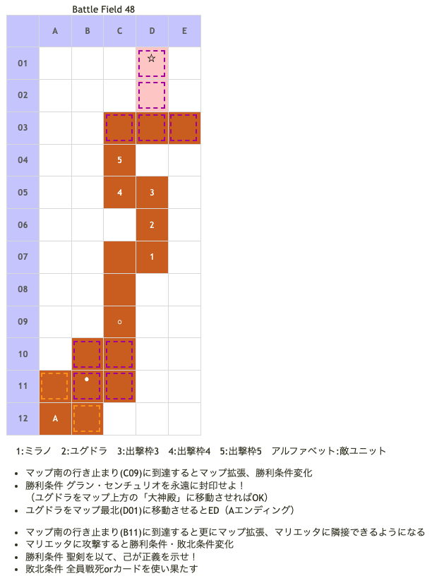

# Battle Field 48 ヘヴンズゲート

- 出撃ユニット ユグドラ・ミラノ+3人
- カード16枚

## 勝利条件 

- ???

## 敗北条件 

- カードを使い果たす

## マップ 

## 敵ユニット 

|NO.|名前|ユニット|Lv|士気初期値|GEN|ATK|TEC|LUK|POW|アイテム|スキル|備考|
|---|---|---|---|---|---|---|---|---|---|---|---|---|
|A|マリエッタ|アークエンジェル(杖)|75 (20)|???? (20000)|☆6|☆6|☆6|☆6|120|叡智の聖杖|リヴェリオン(POW666)|ステータス異常無効 A.S.シールド HP制御システム |

- 「叡智の聖杖」の装備効果「ゲージMAXになる」は効いていない。
- A.S.シールドは全てのカードスキル効果及びクリティカルをキャンセルする。
  - 従って、フレイムやブリザードのダメージは皆無。盗んだり呪ったりもできない。
  - ただしバンシーズクライ、フォーチュン、オブリヴィアスドーン、キスオブデスは有効。エースガードやシールドバリアなどの防御系スキルも効果がある。
  - 装備効果の「一騎討ち必勝」もキャンセルする。
  - 「神圈マセラマティ」(ミラノ)の「まれに一撃必殺」が発動すれば、マリエッタの士気(HP)は1になる。（3巡目で一撃必殺が発動したのに、士気が6000ちょっと残ってた。8ｋ〜10ｋ減らすだけで、必ず1まで減らせるわけではない）（PSP版不可）
- MAP上で確認できるが、マリエッタはLv75。
- 戦闘中のマリエッタはLv20相当だが、無敵なので勝てない。
- 戦闘では負けているように見えても、マリエッタのHPは次の戦闘に持ち越すため、士気(HP)が少しずつ減少している。
  - 減少量はカードPOWに依存せず、あくまで戦闘中に削ったHPのみ。
  - リヴェリオンが発動すると、何人残っていても必ず全滅する。ジハードと同じ効果。
  - 一人でリヴェリオン発動までに削れるHPの量は
    - Lv20、ATK☆6の杖同士なら、アグレッシブを駆使して550程度。
    - 荒野に強い、夜が得意、弓、はそれより若干アップ、剣槍斧は若干ダウン。
    - ファンネリア装備時は700程度（ただし、属性がつかないキャラは無意味）。
- 士気(HP)を1/????まで削ることでA.S.シールドがS.シールドに変化する。
  - ジハードが通じるようになり、これで勝利。
- 士気が1になると、マリエッタはリヴェリオンを発動しなくなる。
- ユグドラに「カチューシャ」か「ふりふりレース」を装備させておこう。チャージ妨害されて負けたら目も当てられない。
- 常時Aggressiveになれる「カルネージクロー」はこのタイミングでエレナに装備させよう。スキルがほとんど通用しないこともあり、装備効果が100％活きる。
- 封印ED(Aエンディング)では叡智の聖杖が、撃退ED(Cエンディング)では天使の輪がそれぞれアイテム図鑑に追加されると思われる。
- マリエッタへの士気ダメージ計算は、[GBA版のバトルパート解説](http://yggdra.heriet.info/BattleSystem.html)を参考に。 （ただし、ユニット数の変更等によりPSP版では計算も若干変わっているはず。……どなたか、PSP版の作成求む）

## 勝利後イベント 
 　

## MVPターン数制限 

- ＋２:15ターン以下
- ＋１:16ターン以上
- 無し:リトライ

## 関連 

- [Chapter 9](Chapter9.md)

### 次 

- [Battle Field 49](BattleField49.md)

### 前 

- [Battle Field 47](BattleField47.md)
