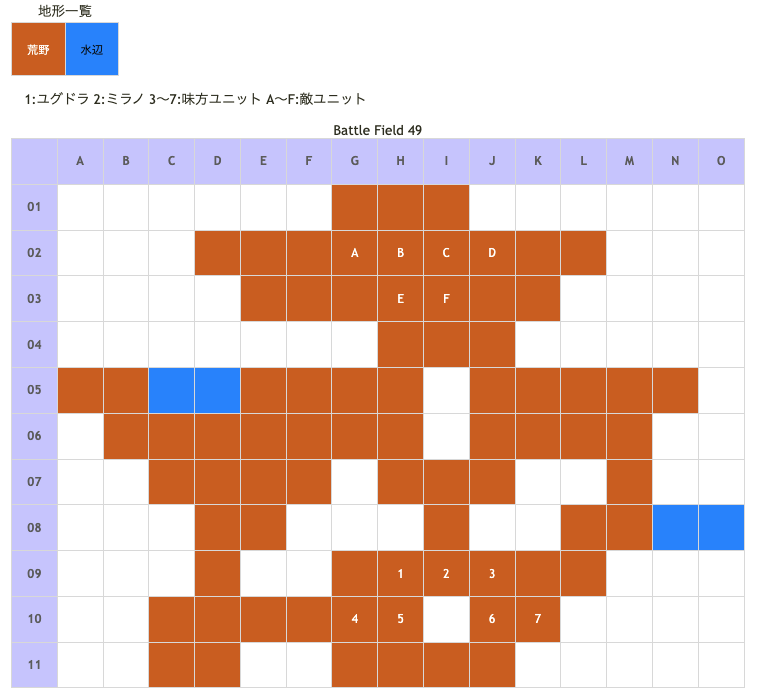

# Battle Field 49 ヘヴンズゲート～連環石群

- バトル難易度HARD(辛口設定)でエンディングCを達成すると、BF49がプレイ可能になる
- 出撃ユニット ユグドラ・ミラノ+5人
- カード10枚
- 夜固定

## 勝利条件 

- 367号を撃破せよ！

## 敗北条件 

- 全員撃破されると…
- カードを使い果たすと…

## マップ 

## 取得可能アイテム 

|名前|時期|-|位置|備考|
|---|---|---|---|---|
|上級勲章|49|落|E(上級神界兵)|LUK☆4|
|試トゥールII型|49|落|F(367号)|スティール不可|

## 敵ユニット 

- 敵部隊(神界勢力) : コーマカルマ (Power:3700 Move:07 Ace:ALL)

|No.|名前|ユニット|Lv|士気|Gen|Atk|Tec|Luk|Pow|装備|備考|
|---|---|---|---|---|---|---|---|---|---|---|---|
|A|神界兵|サーヴァント|20|7600|40|41|42|32|100|装備なし|Rage神聖 (Lユニット)|
|B|神界兵|サーヴァント|20|7600|40|41|42|32|100|装備なし|Rage神聖 (Lユニット)|
|C|神界兵|サーヴァント|20|7600|40|41|42|32|100|装備なし|Rage神聖 (Lユニット)|
|D|神界兵|サーヴァント|20|7600|40|41|42|32|100|装備なし|Rage神聖 (Lユニット)|
|E|上級神界兵|サーヴァント|25|8600|50|51|60|42|130|上級勲章|Rage神聖 (Lユニット) パニック回避(装備) プロテクト|

- 備考
  - 上級神界兵撃破で神界兵消滅
  - 上級神界兵のコーマカルマはGEN最大でも喰らってしまう、相手が何人かユニオンを組んでいると一方的に攻撃されてやられてしまうこともある
    - 上級勲章が無ければTEC5になるので、真っ先にスティールかアイテムブレイクを使えば阻止することも可能

- 敵部隊(神界勢力) : ジャッジメントゼロ (Power:3400 Move:05 Ace:斧)

|No.|名前|ユニット|Lv|士気|Gen|Atk|Tec|Luk|Pow|装備|備考|
|---|---|---|---|---|---|---|---|---|---|---|---|
|F|367号|ジ・エンジェリック|15|4400|40|40|40|20|110|試トゥールII型|Rage冷気 ステータス異常無効 劣勢で士気回復 D.プロテクション まれに猛反撃(装備) プロテクト|

- 備考
  - Aggressive攻撃は冷気属性
  - D.プロテクションは突撃・反撃・クリティカル等のあらゆる付加効果を防ぐ(冷気以外の属性攻撃は通る)
  - 一定量士気ダメージ(恐らく残り1000未満)を与えると、上級神界兵による367号強化イベント発生＆プロテクト解除。

### 367号強化イベント後

- 敵部隊(神界勢力) : コーマカルマ (Power:3700 Move:07 Ace:ALL)

|No.|名前|ユニット|Lv|士気|Gen|Atk|Tec|Luk|Pow|装備|備考|
|---|---|---|---|---|---|---|---|---|---|---|---|
|A|神界兵|サーヴァント|20|7600|40|41|42|32|100|装備なし|Rage神聖 (Lユニット)|
|B|神界兵|サーヴァント|20|7600|40|41|42|32|100|装備なし|Rage神聖 (Lユニット)|
|C|神界兵|サーヴァント|20|7600|40|41|42|32|100|装備なし|Rage神聖 (Lユニット)|
|D|神界兵|サーヴァント|20|7600|40|41|42|32|100|装備なし|Rage神聖 (Lユニット)|
|E|上級神界兵|サーヴァント|25|8600|50|51|60|42|130|上級勲章|Rage神聖 (Lユニット) パニック回避(装備)|

- 備考
  - 上級神界兵撃破で神界兵消滅

- 敵部隊(神界勢力) : ジャッジメントゼロ (Power:5400 Move:05 Ace:斧)

|No.|名前|ユニット|Lv|士気|Gen|Atk|Tec|Luk|Pow|装備|備考|
|---|---|---|---|---|---|---|---|---|---|---|---|
|F|367号|ジ・エンジェリック|30|9999|60|50|60|50|150|試トゥールII型|Rage冷気 ステータス異常無効 少しずつ士気低下 D.プロテクション まれに猛反撃(装備)|

- 備考
  - 強化後の367号にジャッジメントゼロを食らうと高確率で全滅してしまう
  - ステータス異常無効のユグドラや、荒野が得意なミラノ、水辺が得意で冷気攻撃は無効のニーチェであれば、生き残る場合がある

## 戦闘中イベント 

- 367号に一定量士気ダメージを与えると、上級神界兵による367号強化イベント発生
- 全キャラ、上級神界兵および367号に隣接すると会話。戦闘結果により戦闘後会話変化
- 全キャラ、強化イベント後の上級神界兵および367号に隣接すると会話(上級神界兵は強化前と同内容)。戦闘結果により戦闘後会話変化

## 勝利後イベント 

- ユグドラ・ミラノ・デュランの会話(上級神界兵が生存の場合、上級神界兵の台詞が追加)

## 敗北後イベント 

- 全滅した場合、上級神界兵が生存しているか否か＆367号が強化されたか否かで会話変化

## 戦術アドバイス 

- クリアだけならユグドラだけで可能。367号は斧持ちなので、弓・槍キャラは不向き
- 神界兵とユニオンを組まれると面倒なので、高Powのカードで367号の士気を一気に削る
  - 「○まれに猛反撃」があるので、こちらから攻めずに受けに回ると安全
- 強化イベント後、ユグドラのジハードで攻め込む。次ターンでユグドラを攻めてくればジハードで返り討ち
  - BF-48で装備したカチューシャが残っているはずなので、瞬間チャージで楽々
  - 367号の反撃次第では先にジャッジメントゼロを発動される事もあるので、中断セーブを活用
  - ジハードのPowが低い場合は、味方を盾にしてターン数を稼ぎ、367号の士気が減るのを待つと良い
- フェアリーベルを装備するとジャッジメントゼロ発動前に勝利できる
- ファンネリアを装備して属性攻撃スキル[フレイム、ブリザード、サンダーボルト、バニッシュ、グラヴィティカオス]を発動すれば強化後の367号だろうと一撃で撃破可能
  - 神界兵は神聖、367号は冷気を無効化するがファンネリアでの即死は無効化できない

## 関連 

### 前 

- [Chapter 9](Chapter9.md)

- [Battle Field 48](BattleField48.md)
